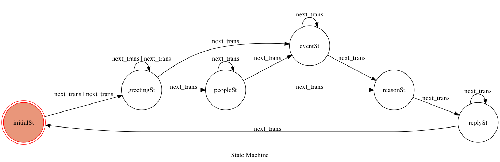
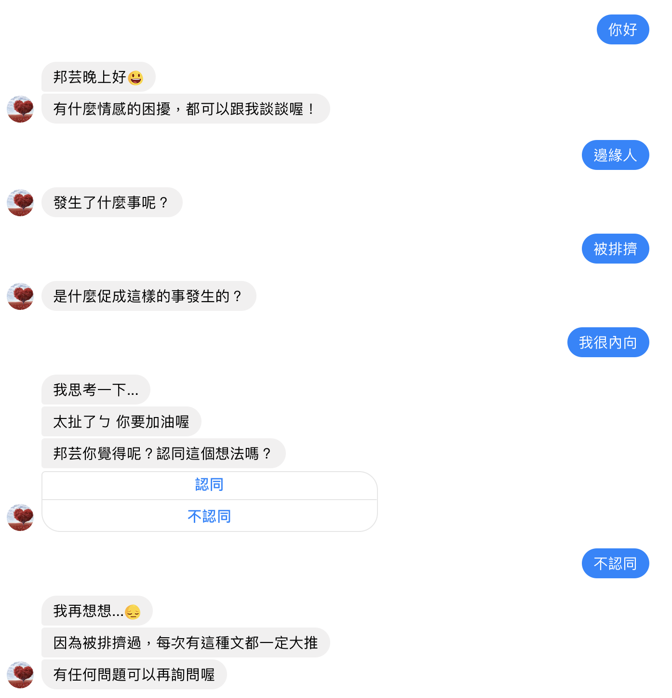

# LoveBot
This is a practice of bot. The goal of the LoveBot is 'Emotional consultation'.

## Description
Analysis the articles on Dcard. According to the question of the user asks, response the best answer to the user.
In order to search the best answer on Dcard **(which means the answer meets the user question)**, here I consider the two part to produce the best answer :
1. The similarity between the user sentences and the Dcard articles 
2. The sentiments of the user and the responses under the most similar article

### The first part:
I use the NER tool (http://140.116.245.151/NER_news_fe/) to do the word segmentation. To compare the similarity of the segentations of the users and the articles, I use two way to evaluate
- cosine similarity
- BM25

Based on these two ways to find the most similar articles.

### The second part:
Here simply compare the sentiment between user and the responses under the chosen article(describe above), then choose the sentiment most similar one as response to user.

The below graph is the whole process of LoveBot:

## Demo
Here show some demo of conversation between the bot and the user.
The bot set on facebook.

